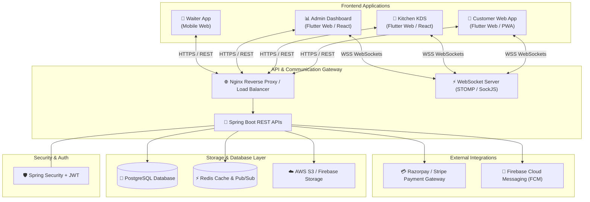
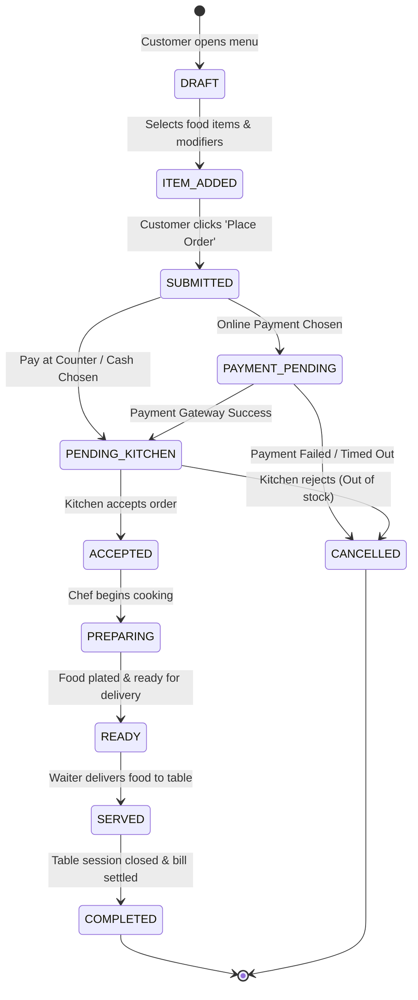

# 📋 Project Specification: Smart Contactless Dining Platform (SCDP)

> **Document Version**: 2.0.0  
> **Status**: Approved Specification  
> **Last Updated**: July 20, 2026  
> **Target Ecosystem**: Web Applications (Customer Mobile Web, Kitchen KDS, Admin Portal)  

---

## 1. 📌 Executive Summary & Project Overview

### 1.1 Summary
The **Smart Contactless Dining Platform (SCDP)** (also branded as *DineFlow*) is an end-to-end digital restaurant management platform. It transforms the traditional dine-in experience by eliminating physical paper menus, manual waiter order-taking, and slow billing procedures.

Through a table-specific QR-code scan, customers immediately access a responsive, web-based digital ordering application on their mobile devices without needing to download any app. Restaurant operations are synchronized in real time across a **Kitchen Display System (KDS)** and an **Admin Management Dashboard**.

```
📱 Customer (Scans Table QR)  ──► 🛒 Self-Ordering App ──► ⚡ Live Kitchen KDS ──► 💳 Digital Billing
```

### 1.2 Core Value Proposition
- **For Customers**: Fast ordering, complete menu customization, price transparency, real-time cooking progress tracking, and instant digital payments.
- **For Restaurants**: Lower operational costs, elimination of order entry errors, faster table turnover, real-time inventory management, and data-driven business analytics.

---

## 2. 🚨 Problem Statement & Strategic Objectives

### 2.1 Problem Statement
Traditional dine-in operations suffer from multiple friction points:
- **Order Delays**: Customers wait up to 15 minutes just to receive a menu and place an initial order.
- **Order Inaccuracies**: Verbal communication between customers and waitstaff frequently leads to incorrect food customization or forgotten items.
- **High Operational Overhead**: Staff spending disproportionate time taking orders and processing payments rather than focusing on hospitality.
- **Opaque Order Status**: Customers repeatedly request status updates from waiters due to lack of visibility into kitchen progress.
- **Lack of Real-Time Analytics**: Restaurant management lacks immediate insights into peak hours, best-selling items, ingredient depletion, and revenue trends.

### 2.2 Project Objectives
1. **Zero-Paper Operations**: Replace printed menus with real-time digital menus.
2. **Sub-2-Second Menu Access**: Ensure frictionless mobile access upon QR scan without app downloads.
3. **Sub-Second Order Synchronization**: Push placed orders to the kitchen instantly using WebSockets.
4. **Streamlined Kitchen Workflow**: Provide kitchen staff with clear order queues and automated status transitions.
5. **Integrated Payment & Invoicing**: Support cashless checkout options (UPI, Credit/Debit Cards, NetBanking, Cash) with instant digital invoices.
6. **Data-Driven Management**: Empower managers with real-time inventory tracking, low-stock alerts, and sales analytics.

---

## 3. 👥 User Roles & Access Control (RBAC Matrix)

| Role | Access Level | Primary Responsibilities |
| :--- | :--- | :--- |
| `CUSTOMER_GUEST` | Mobile Web App (Table Session) | Browse menu, customize food, place orders, track live status, request waiter assistance, pay bill, leave feedback. |
| `KITCHEN_STAFF` / `CHEF` | Kitchen Display System (KDS) | View incoming orders, accept orders, update preparation stages (*Preparing* ➔ *Cooking* ➔ *Plating* ➔ *Ready*). |
| `WAITER` | Mobile Staff App / Web | View assigned tables, receive "Call Waiter" alerts, mark orders as *Served*, collect cash payments. |
| `CASHIER` | Cashier Terminal Dashboard | View active billings, process cash/offline payments, print paper receipts if requested, close table sessions. |
| `RESTAURANT_ADMIN` | Full Admin Portal | Manage menu items & prices, manage inventory & alerts, view sales reports & analytics, manage staff accounts, generate table QR codes. |
| `SUPER_ADMIN` | Multi-Tenant Platform Portal | Manage multiple restaurant branches, global system configurations, platform subscription plans. |

---

## 4. ⚡ Core Modules & Functional Requirements

### 4.1 QR Code & Table Session Management
- **Table-Unique QR Codes**: Each table is assigned a secure URL containing table ID and encrypted session tokens (`https://dineflow.com/table/{tableId}?token={token}`).
- **Session Locking**: Prevents unauthorized remote orders by validating table location and active session state.
- **No App Installation**: Operates as a Progressive Web App (PWA) compatible with all modern browsers (iOS Safari, Android Chrome).

### 4.2 Digital Menu & Food Customization
- **Dynamic Categories**: Starters, Main Course, Beverages, Desserts, Chef Specialties, Dietary Filters (Veg, Non-Veg, Vegan, Gluten-Free, Spicy Level).
- **Rich Media**: High-definition images, detailed ingredient lists, allergen warnings, and preparation time indicators.
- **Advanced Item Modifiers & Variants**:
  - *Size Variants*: Small, Medium, Large.
  - *Add-ons*: Extra Cheese, Gluten-Free Crust, Additional Toppings.
  - *Exclusions*: No Onions, Less Oil, Extra Spicy.
- **Live Price Calculation**: Cart total recalculates dynamically as modifiers and add-ons are toggled.

### 4.3 Shopping Cart & Order Checkout
- Real-time cart updates with tax (GST/VAT) and service charge breakdown.
- Support for coupon code applications and promotional discounts.
- Special instructions field for dietary requirements or custom kitchen notes.

### 4.4 Real-Time Order Tracking & Kitchen Display System (KDS)
- **Live State Synchronization**: Dual-way real-time communication using WebSockets.
- **Kitchen Queue Card UI**: Visual color-coded cards for incoming, preparing, and ready orders with timer indicators highlighting long-pending items.
- **Automated Customer Notifications**: Customer UI updates status indicators instantly upon chef state updates.

### 4.5 Digital Payments & Invoicing
- **Multi-Payment Gateway Integration**: Razorpay / Stripe integration supporting UPI (Google Pay, PhonePe, Paytm), Credit/Debit Cards, Net Banking.
- **Pay at Counter / Cash Support**: Option to request cash collection at the table or cashier counter.
- **Automated Digital Invoice**: Instant generation of itemized GST-compliant invoices downloadable as PDF or sent via SMS/WhatsApp.

### 4.6 Admin Dashboard & Management
- **Menu Management**: CRUD operations for items, categories, pricing, and instantaneous toggle for "Out of Stock" items.
- **Inventory Tracking**: Stock quantity monitoring for raw ingredients, low-stock threshold triggers, and vendor directory.
- **Table & QR Manager**: Generate, download, and print table QR codes in vector SVG/PNG formats.
- **Sales & Operations Analytics**: Interactive charts showing daily revenue, peak hours, average order fulfillment time, customer rating trends, and top-selling items.

### 4.7 Waiter Assistance ("Call Waiter") System
- One-tap customer requests: *Request Water*, *Request Extra Cutlery/Napkins*, *Request Cashier / Bill*, *General Assistance*.
- Instant alert badges sent to assigned waiter devices with table location.

---

## 5. 💡 Advanced & Optional Premium Features

> [!NOTE]
> These features can be enabled incrementally as modular add-ons.

- **AI Recommendations**: Smart "Frequently Bought Together" recommendations during cart checkout (e.g., suggesting garlic bread when adding pasta).
- **Dynamic Estimated Preparation Time (EPT)**: Algorithmic time estimation based on current kitchen queue load, chef staffing, and item complexity.
- **Smart Inventory Forecasting**: Machine-learning predictions for raw ingredient depletion based on historical sales patterns and upcoming reservations.
- **Customer Loyalty Program**: Reward points earned per order, redeemable for discounts or free beverages on subsequent visits.
- **Bill Splitting**: Enables multiple guests seated at the same table to split the final bill equally or by selected items.
- **Multi-Branch Tenant Management**: Master dashboard for restaurant chains to monitor revenue, menus, and staff across multiple locations.

---

## 6. 🏗️ System Architecture & Data Flow

### 6.1 High-Level Component Architecture



---

### 6.2 Order Lifecycle State Machine



---

## 7. 🗄️ Database Design & Data Model (ERD)

```mermaid
erDiagram
    RESTAURANT ||--o{ RESTAURANT_TABLE : owns
    RESTAURANT ||--o{ CATEGORY : offers
    RESTAURANT ||--o{ USER : employs
    
    CATEGORY ||--o{ MENU_ITEM : contains
    MENU_ITEM ||--o{ ITEM_VARIANT : has
    MENU_ITEM ||--o{ ITEM_MODIFIER : allows
    
    RESTAURANT_TABLE ||--o{ TABLE_SESSION : hosts
    TABLE_SESSION ||--o{ ORDER : includes
    
    ORDER ||--o{ ORDER_ITEM : contains
    ORDER_ITEM ||--o{ ORDER_ITEM_MODIFIER : includes
    ORDER ||--o1 PAYMENT : requires
    ORDER ||--o1 INVOICE : generates
    ORDER ||--o1 FEEDBACK : receives
    
    RESTAURANT ||--o{ INVENTORY_ITEM : tracks

    RESTAURANT {
        uuid id PK
        string name
        string address
        string phone
        string gst_number
    }

    RESTAURANT_TABLE {
        uuid id PK
        uuid restaurant_id FK
        integer table_number
        integer seating_capacity
        string qr_code_url
        enum status
    }

    TABLE_SESSION {
        uuid id PK
        uuid table_id FK
        datetime start_time
        datetime end_time
        enum session_status
    }

    MENU_ITEM {
        uuid id PK
        uuid category_id FK
        string name
        string description
        decimal base_price
        boolean is_available
        boolean is_veg
        string image_url
    }

    ORDER {
        uuid id PK
        uuid session_id FK
        string order_number
        enum order_status
        enum payment_status
        decimal subtotal
        decimal tax_amount
        decimal discount_amount
        decimal total_amount
        datetime created_at
    }

    ORDER_ITEM {
        uuid id PK
        uuid order_id FK
        uuid item_id FK
        integer quantity
        decimal item_price
        string kitchen_notes
    }

    PAYMENT {
        uuid id PK
        uuid order_id FK
        string transaction_id
        enum payment_method
        enum payment_status
        decimal amount
        datetime paid_at
    }
```

---

## 8. 🛠️ Technology Stack Recommendations

| Layer | Technology | Justification |
| :--- | :--- | :--- |
| **Customer Web App** | **Flutter Web** / **React PWA** | Cross-platform, high-performance UI, fast responsive rendering on mobile viewports. |
| **Kitchen KDS & Admin** | **Flutter Web** / **React (Vite)** | Modular component hierarchy, rich dashboard charts, clean WebSocket integration. |
| **Backend Framework** | **Java Spring Boot 3.x** | Enterprise-grade stability, robust Spring Security, Spring Data JPA, native STOMP WebSocket support. |
| **Security & Auth** | **Spring Security + JWT** | Stateless token authentication with RBAC role enforcement. |
| **Primary Database** | **PostgreSQL** | ACID-compliant relational data management, JSONB support for flexible menu item options. |
| **Cache & Message Broker**| **Redis** | Session management, active order queue caching, and WebSocket message publishing. |
| **Cloud File Storage** | **Firebase Storage / AWS S3** | Secure storage and CDN delivery for food images and vector QR code graphics. |
| **Payment Gateway** | **Razorpay API** | Seamless SDK support for UPI, Cards, NetBanking, and Webhooks for payment confirmation. |
---

## 9. 🔌 Core API Endpoints Specification

### 9.1 Authentication & Table Session
- `POST /api/v1/auth/table-session/init` — Initialize session from QR scan code.
- `POST /api/v1/auth/staff/login` — Staff login returning JWT access & refresh tokens.

### 9.2 Menu & Catalog
- `GET /api/v1/menu/categories` — Fetch all active menu categories with items.
- `GET /api/v1/menu/items/{id}` — Fetch detailed item info with variants & modifiers.
- `POST /api/v1/admin/menu/items` — `[ADMIN]` Create new menu item.
- `PUT /api/v1/admin/menu/items/{id}/availability` — `[ADMIN/KITCHEN]` Toggle item availability.

### 9.3 Ordering & Kitchen Workflow
- `POST /api/v1/orders` — Submit new order from cart.
- `GET /api/v1/orders/{orderId}/status` — Poll order status.
- `GET /api/v1/kitchen/orders/active` — `[KITCHEN]` Fetch active kitchen queue.
- `PATCH /api/v1/kitchen/orders/{orderId}/status` — `[KITCHEN]` Update status (`PREPARING`, `READY`, `SERVED`).

### 9.4 Payments & Invoicing
- `POST /api/v1/payments/create-intent` — Generate payment gateway order ID.
- `POST /api/v1/payments/verify` — Verify gateway signature and update order payment status.
- `GET /api/v1/orders/{orderId}/invoice` — Generate PDF invoice for download.

### 9.5 WebSocket Event Topics (STOMP)
- `SUBSCRIBE /topic/table/{tableId}/order-updates` — Receive live order state changes on customer web app.
- `SUBSCRIBE /topic/kitchen/new-orders` — Receive instant new order alerts on kitchen KDS.
- `SUBSCRIBE /topic/waiter/alerts` — Receive table assistance requests for waitstaff.

---

## 10. 🛡️ Non-Functional Requirements & Key Metrics

> [!IMPORTANT]
> To guarantee production readiness, the system must satisfy the following SLAs:

1. **Performance**:
   - Menu load time: `< 1.5 seconds` on 3G network.
   - API response latency: `< 200 milliseconds` (p95).
   - Real-time WebSocket delivery latency: `< 500 milliseconds`.
2. **Reliability & Availability**:
   - System uptime: `99.9%`.
   - Automatic reconnect capability for WebSocket clients upon network disruption.
3. **Security**:
   - All network traffic encrypted over HTTPS (TLS 1.3) and WSS.
   - Passwords hashed using BCrypt.
   - Session tokens restricted using short-lived JWTs.
   - Payment card data processed exclusively via PCI-DSS compliant gateways (Razorpay/Stripe).
4. **Usability & Accessibility**:
   - Mobile-first responsive layout (optimized for 320px to 430px screen widths).
   - High color contrast ratio for easy readability in restaurant lighting.

---

## 11. 🚀 Expected Benefits & Impact

```
┌───────────────────────────────────────┐   ┌───────────────────────────────────────┐
│           FOR CUSTOMERS               │   │           FOR RESTAURANTS             │
├───────────────────────────────────────┤   ├───────────────────────────────────────┤
│ ⚡ Instant ordering without waiting   │   │ 📉 40% reduction in order wait time   │
│ 🎯 Zero ordering errors or mix-ups   │   │ 💰 Higher average order value (upsell)│
│ 📱 Total visibility on order status   │   │ 📦 Real-time inventory tracking       │
│ 💳 Contactless & quick checkout       │   │ 📊 Actionable business analytics      │
└───────────────────────────────────────┘   └───────────────────────────────────────┘
```

---

## 12. 🎯 Project Roadmap & Conclusion

The **Smart Contactless Dining Platform** provides a complete, modern, and scalable architecture suitable for implementation as both a high-impact academic showcase and a commercial-ready SaaS solution. By replacing manual touchpoints with secure digital workflows, SCDP maximizes efficiency, boosts revenue, and delivers a superior customer experience.