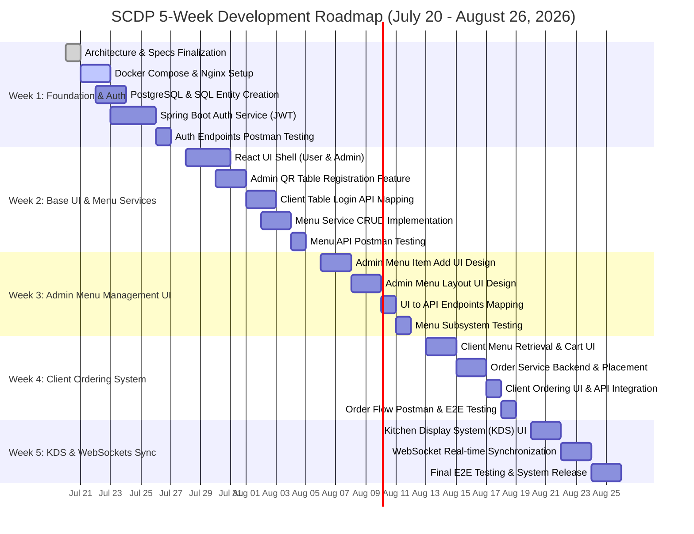

# 📅 Project Development Timeline: Smart Contactless Dining Platform (SCDP)

> **Project Start Date**: July 20, 2026  
> **Target Release Date**: August 26, 2026  
> **Development Approach**: Agile Microservices Development & 5-Week Sprint Roadmap  

---

## 📊 Visual Gantt Chart (5-Week Schedule)



---

## 🗺️ Milestone Roadmap

```mermaid
timeline
    title 5-Week Sprint Milestones
    section Week 1 : Infrastructure & Security
        20/7 - 22/7 : Architecture & Docker Compose Setup
        23/7 - 25/7 : PostgreSQL Schemas & Spring Boot Auth
        26/7 - 27/7 : JWT RBAC & Postman Endpoint Testing
    section Week 2 : Base UI & Menu Service
        28/7 - 31/7 : React Web UI (User & Admin Shell)
        01/8 - 03/8 : QR Table Registration & Client Table Login API
        04/8 - 05/8 : Express Menu CRUD & Postman Verification
    section Week 3 : Admin Menu UI & Integration
        06/8 - 08/8 : Admin UI Page for Menu Item Adding
        09/8 - 10/8 : Admin UI Page for Menu Designing
        11/8 - 12/8 : API UI Mapping & Menu Management System Testing
    section Week 4 : Client Ordering Subsystem
        13/8 - 15/8 : Client Menu Retrieval & Cart UI
        16/8 - 18/8 : Order Placement API & Client Service Mapping
        19/8 - 19/8 : Order Checkout & Postman E2E Testing
    section Week 5 : KDS & WebSockets Integration
        20/8 - 22/8 : Kitchen Display System (KDS) Admin/Kitchen Pane
        23/8 - 24/8 : Real-Time WebSockets Order Sync & Notification Svc
        25/8 - 26/8 : Final System Testing & Deployment Build
```

---

## 🗓️ Detailed 5-Week Sprint Breakdown

### 🔹 Week 1 [20/7 - 27/7] — Initialization & Starter Services

> **Goal**: Create architecture, Docker container setup with Nginx, PostgreSQL schema, and Spring Security Auth endpoints.

- `[DIR]` **Project Architecture Creation**: Finalize project specification and microservices architecture.
- `[SERVER]` **All Service Containerization**: Set up Dockerfiles and `docker-compose.yml` including Nginx Gateway proxy.
- `[DATABASE]` **PostgreSQL Database Creation**: Define SQL schemas and relational entities (Users, Tables, Orders, Payments).
- `[SERVER]` **Spring Security Implementation**: Implement Auth Service in Spring Boot 3.x with JWT issuance and RBAC roles.
- `[SERVER]` **Auth Service Endpoints**: Create endpoints for login, register, and token validation.
- `[TEST]` **Postman Endpoint Testing**: Test and verify Auth Service endpoints in Postman.

---

### 🔹 Week 2 [28/7 - 05/8] — Base Web UI & Menu Service CRUD

> **Goal**: Build base React application shell for User & Admin, Table QR registration flow, and Express Menu Service CRUD.

- `[UI]` **Creating UI for Web App**: Setup base React 18 frontend architecture (User & Admin portals).
- `[UI]` **QR-Based Table Registering Feature**: Build Admin UI feature to register and generate QR codes for tables.
- `[UI/SERVER]` **Mapping API for Client Side**: Implement client-side table login flow using scanned QR code parameters.
- `[SERVER]` **Menu Service CRUD Implementation**: Build Node.js / Express service for Registering, Modifying, and Deleting Menu items and categories.
- `[SERVER]` **Creating Menu Endpoints**: Expose REST endpoints (`/api/v1/menu/items`, `/api/v1/menu/categories`).
- `[TEST]` **Testing Endpoints on POSTMAN**: Verify Menu Service endpoints and catalog persistence.

---

### 🔹 Week 3 [06/8 - 12/8] — Admin Menu UI & Integration Testing

> **Goal**: Design Admin Menu management interfaces, map React UI to backend endpoints, and test the menu subsystem.

- `[DESIGN]` **UI Page for Menu Item Adding**: Design and implement Admin form UI for adding new menu items, pricing, and variants.
- `[DESIGN]` **UI Page for Menu Designing**: Design Admin layout page for organizing menu categories, item availability toggles, and layout customization.
- `[UI/SERVER]` **Mapping UI with API Endpoints**: Connect React Admin UI components to Node/Express Menu Service REST endpoints.
- `[TESTING]` **Testing the Whole Subsystem**: Comprehensive testing of Admin menu management and client menu rendering.

---

### 🔹 Week 4 [13/8 - 19/8] — Client Ordering Subsystem & Checkout

> **Goal**: Build client-side menu retrieval, shopping cart, order submission, and Order Service backend integration.

- `[UI]` **Client Menu Retrieval UI**: Build Customer mobile UI to fetch and render menu categories, food items, and item details.
- `[UI]` **Shopping Cart & Checkout UI**: Create interactive shopping cart, item customization modal (variants, add-ons), and order summary view.
- `[SERVER]` **Order Service Development**: Implement Node.js / Express Order Service for order creation, tax/discount calculation, and state storage in PostgreSQL.
- `[UI/SERVER]` **Client Order API Mapping**: Connect React Customer cart UI with Order Service endpoints (`POST /api/v1/orders`).
- `[TESTING]` **Order Subsystem Testing**: Perform Postman and integration testing for client order placement and retrieval.

---

### 🔹 Week 5 [20/8 - 26/8] — Kitchen KDS & Real-Time WebSockets Integration

> **Goal**: Build Kitchen Display System (KDS), implement real-time WebSockets synchronization, and run full end-to-end testing.

- `[UI]` **Kitchen Display System (KDS) UI**: Build Admin/Kitchen pane for displaying active orders with color-coded status cards.
- `[SERVER]` **Real-Time WebSockets Implementation**: Set up Notification Service with WebSockets (Socket.io / WS) and Redis Pub/Sub for instant order broadcasts.
- `[UI/SERVER]` **Live Status Synchronization**: Connect Kitchen KDS status updates (`PREPARING` ➔ `READY` ➔ `SERVED`) to Customer live order tracking screen.
- `[TESTING]` **Full System E2E Testing**: Complete end-to-end verification of entire flow: Table QR Scan ➔ Login ➔ Browse Menu ➔ Place Order ➔ KDS Notification ➔ Chef Update ➔ Customer Status Tracking.
- `[DEVOPS]` **Final Build & Release**: Prepare production Docker deployment build.

---

## 📈 5-Week Progress Tracker

| Week | Target Window | Status | Core Objective |
| :--- | :--- | :--- | :--- |
| **Week 1** | 20/7 - 27/7 | 🟡 In Progress | Docker, Nginx, PostgreSQL, Spring Boot Auth & JWT Endpoints |
| **Week 2** | 28/7 - 05/8 | ⚪ Pending | Base React UI (User & Admin), Table QR Registering, Express Menu CRUD |
| **Week 3** | 06/8 - 12/8 | ⚪ Pending | Admin Menu Adding/Designing UI, API Mapping, Menu Subsystem Testing |
| **Week 4** | 13/8 - 19/8 | ⚪ Pending | Client Menu Retrieval, Cart UI, Order Service Backend & Order Placement |
| **Week 5** | 20/8 - 26/8 | ⚪ Pending | Kitchen KDS, WebSockets Real-Time Sync, Final E2E System Testing |
