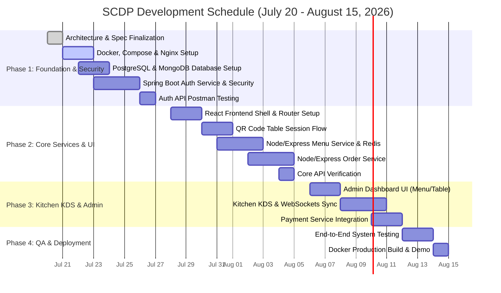

# 📅 Project Development Timeline: Smart Contactless Dining Platform (SCDP)

> **Project Start Date**: July 20, 2026  
> **Target Release Date**: August 15, 2026  
> **Development Approach**: Agile Microservices Development & Iterative Sprints  

---

## 📊 Visual Gantt Chart



---

## 🗺️ Milestone Roadmap

```mermaid
timeline
    title Key Sprint Milestones
    section Week 1 : Infrastructure & Security
        20/7 - 22/7 : Architecture Specifications & Docker Compose Base
        23/7 - 25/7 : Database Schemas (PostgreSQL & MongoDB) & Spring Boot Auth
        26/7 - 27/7 : JWT Authentication & Postman API Verification
    section Week 2 : Core Services & Customer UI
        28/7 - 30/7 : React App Shell & QR Table Session Login UI
        31/7 - 02/8 : Express Menu Service + MongoDB + Redis Cache
        03/8 - 05/8 : Order Service CRUD & Cart Checkout Logic
    section Week 3 : KDS, Admin & WebSockets
        06/8 - 08/8 : Admin Dashboard UI (Menu Customization & Table Management)
        09/8 - 11/8 : Kitchen Display System (KDS) & Real-Time WebSockets
        12/8 - 13/8 : Razorpay Payment Service & Digital PDF Invoicing
    section Week 4 : Verification & Deployment
        14/8 - 15/8 : System Integration Testing & Final Production Docker Build
```

---

## 🗓️ Detailed Sprint Task Breakdown

### 🔹 Week 1 [20/7 - 27/7] — Infrastructure, Security & Containerization

> **Goal**: Establish containerized microservices environment, database schemas, and Spring Boot JWT security.

- `[DIR]` **Project Architecture & Specs**: Finalize `project.spec.md`, `project.architect.md`, and repository layout.
- `[DEVOPS]` **Microservices Setup & Docker**: Configure `docker-compose.yml`, Dockerfiles for all services, and Nginx reverse proxy routes.
- `[DATABASE]` **Database Initialization**: Create PostgreSQL database schemas for Users, Tables, Orders, Payments; configure MongoDB for Menu catalog.
- `[SERVER]` **Spring Boot Auth Service**: Implement Spring Security, JWT issuing/verification, password encryption (BCrypt), and user RBAC roles (`ADMIN`, `CHEF`, `WAITER`, `CASHIER`).
- `[SERVER]` **Auth API Endpoints**: Expose `/api/v1/auth/login`, `/api/v1/auth/register`, and `/api/v1/auth/validate-token`.
- `[TEST]` **Postman Validation**: Execute integration tests for Auth endpoints and store Postman environment collections.

#### Week 1 Key Deliverables:
- [x] Docker Compose environment running PostgreSQL, MongoDB, Redis, and Nginx.
- [x] Functional Spring Boot Auth Service issuing secure JWTs.
- [x] Verified Postman API test collection.

---

### 🔹 Week 2 [28/7 - 05/8] — Customer Web App & Core CRUD Services

> **Goal**: Build React customer ordering UI, Table QR session login, Menu catalog service, and Order lifecycle service.

- `[UI]` **React Application Shell**: Initialize React 18 (Vite, Tailwind CSS, Redux Toolkit) with responsive customer mobile layout.
- `[UI]` **Table QR Session Authentication**: Implement QR scanner integration and URL token validation (`/table/:tableId?token=...`).
- `[SERVER]` **Menu Service (Node/Express + Mongo + Redis)**: Implement CRUD endpoints for menu categories, food items, variants, and add-on modifiers. Integrate Redis menu caching.
- `[SERVER]` **Order Service (Node/Express + Postgres)**: Implement order creation, tax/bill calculation, and order state storage (`DRAFT` ➔ `SUBMITTED`).
- `[UI/SERVER]` **Customer App API Integration**: Connect React frontend cart and menu views with Express backend services.
- `[TEST]` **Core API Testing**: Validate Menu and Order APIs using Postman.

#### Week 2 Key Deliverables:
- [x] Customer mobile web app browsing menu, customizing items, and submitting orders.
- [x] High-performance cached Menu Service backed by MongoDB & Redis.
- [x] Relational Order Service persisting transactional orders in PostgreSQL.

---

### 🔹 Week 3 [06/8 - 13/8] — Admin Portal, Kitchen KDS & WebSockets

> **Goal**: Build Admin management UI, Kitchen KDS board with real-time WebSockets, and Payment integration.

- `[DESIGN/UI]` **Admin Dashboard UI**: Build Admin pages for Menu CRUD, item availability toggles, category organization, and Table QR generation.
- `[UI/SERVER]` **Kitchen Display System (KDS)**: Build Kitchen KDS queue interface with color-coded order cards and cooking status updates (`PREPARING` ➔ `READY`).
- `[SERVER]` **Real-Time WebSockets (Notification Service)**: Implement Socket.io / WebSocket server with Redis Pub/Sub to sync kitchen card movements with customer live order tracking.
- `[SERVER]` **Payment Service Integration**: Integrate Razorpay SDK for UPI/Card checkout and automated PDF invoice generation.
- `[UI/SERVER]` **Waiter Alert System**: Connect "Call Waiter" button on customer app to push notifications for assigned staff.
- `[TEST]` **Real-Time WebSockets Testing**: Verify multi-client synchronization between Customer UI, Kitchen KDS, and Admin Portal.

#### Week 3 Key Deliverables:
- [x] Functional Admin Dashboard for menu management and QR generation.
- [x] Live Kitchen Display System (KDS) updated instantaneously via WebSockets.
- [x] Integrated Razorpay checkout and digital invoice generation.

---

### 🔹 Week 4 [14/8 - 15/8] — Integration Testing & Production Release

> **Goal**: Perform end-to-end load testing, security audits, container optimization, and final deployment.

- `[TESTING]` **End-to-End Integration Testing**: Simulate complete customer journey: Scan QR ➔ Browse Menu ➔ Add Customizations ➔ Place Order ➔ KDS Kitchen Accept ➔ Cook ➔ Serve ➔ Digital Pay.
- `[DEVOPS]` **Production Docker Build**: Optimize Docker images (multi-stage builds) and Nginx caching headers.
- `[DOCS]` **Final Documentation**: Update README, architecture notes, and user manual.

---

## 📈 Phase Status & Progress Summary

| Phase | Duration | Status | Primary Focus |
| :--- | :--- | :--- | :--- |
| **Phase 1** | 20/7 - 27/7 | 🟡 In Progress | Architecture, Docker Compose, Postgres/Mongo DBs, Spring Auth Svc |
| **Phase 2** | 28/7 - 05/8 | ⚪ Pending | React UI Shell, Table QR Session, Express Menu Svc & Order Svc |
| **Phase 3** | 06/8 - 13/8 | ⚪ Pending | Admin Management UI, Kitchen KDS, WebSockets, Payments |
| **Phase 4** | 14/8 - 15/8 | ⚪ Pending | E2E System Testing, Docker Production Build & Release |
